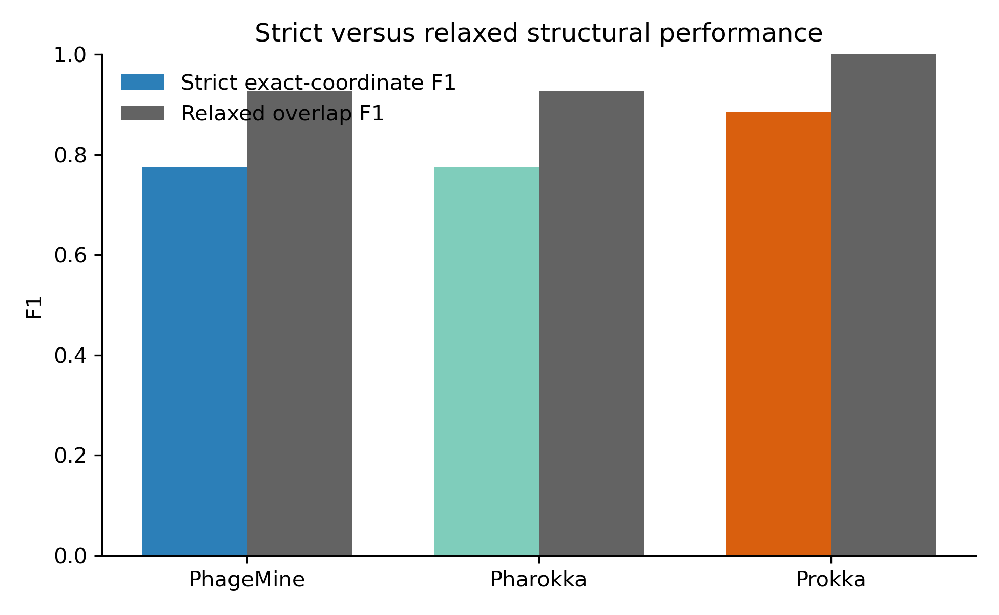
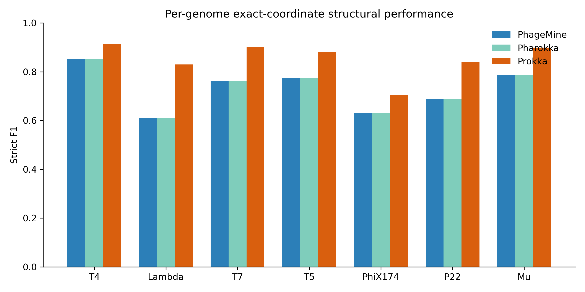
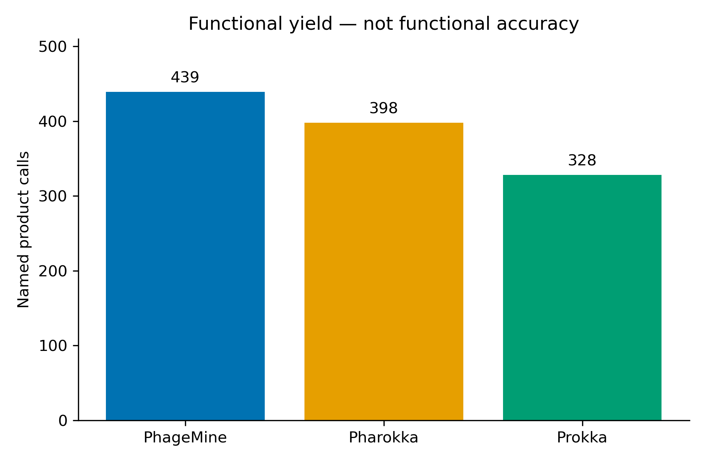

# PhageMine v1.2 benchmark

The corrected benchmark evaluates seven curated reference phages (T4, Lambda,
T7, T5, PhiX174, P22, and Mu). The full local evidence is preserved separately;
this repository distributes compact summaries, provenance, figures, and
checksums under [`docs/benchmark_v1.2/`](benchmark_v1.2/). The reference and
annotation files needed for functional validation are now archived under
[`evaluation/v1.2_functional/`](../evaluation/v1.2_functional/).

## Measured results

| Tool | CDS | Strict F1 | Relaxed F1 | Named products |
|---|---:|---:|---:|---:|
| PhageMine | 804 | 0.7762 | 0.8821 | 439 |
| Pharokka | 804 | 0.7762 | 0.8821 | 398 |
| Prokka | 675 | 0.8846 | 0.9352 | 328 |

PhageMine and Pharokka had identical CDS coordinates across all seven genomes
in this configuration. Their structural scores are therefore identical; their
functional outputs differ downstream. Prokka showed stronger reference-relative
structural agreement on this curated panel.

Strict scoring requires exact accession, start, stop, and strand. Relaxed scoring
counts a same-strand prediction as detecting a reference CDS when it covers at
least 50% of the reference span and has at least 20% reciprocal overlap. Of 216
PhageMine strict non-exact calls, 141 were alternative-boundary or same-strand
overlap cases. These should not automatically be interpreted as false
biological genes. Non-reference calls remain non-reference predictions, not
proven novel CDSs.







## Reproducing the summary

The source tables are in `docs/benchmark_v1.2/tables/`. The included figures
were generated from those tables; no biological databases are required to view
them. To regenerate equivalent plots, run:

```bash
python docs/benchmark_v1.2/scripts/make_figures.py
```

Named-product yield is a lexical output metric, not functional accuracy. The
seven-genome panel is limited, exact coordinates penalize alternative boundaries,
and runtime ranking is unsupported. The historical T4 PHANOTATE 294-versus-297
Linux discrepancy remains unresolved. No universal tool ranking is claimed.

## Functional-yield correction (18 September 2026)

The previous per-genome table incorrectly reported zero named PhageMine
products for all seven genomes. The historical structural generator read
product labels from `genes.gff3`, which did not contain PhageMine's functional
products, instead of joining `annotation.tsv`. Those zeros were invalid; the
validated aggregate of **439** was correct and is unchanged.

Authentic frozen annotation tables were recovered from the original corrected
benchmark workspace. PhageMine counts are T4 **144**, Lambda **56**, T7 **50**,
T5 **95**, PhiX174 **8**, P22 **48**, Mu **38** (sum **439**). Pharokka and Prokka
per-genome counts were independently verified against their frozen GFFs and
are unchanged. The per-genome table now records source paths and SHA256 hashes.
The compact source files and recovery provenance are archived in
`evaluation/v1.2_functional/`; no annotation tool was rerun.

The functional-yield plot is regenerated in PNG, SVG and PDF directly from
`tables/functional_yield_totals.tsv`, with assertions for 439, 398 and 328.
Structural results and structural figures are unchanged. The figure script
regenerates functional yield only; it no longer emits an unrelated structural
plot using a different aggregate averaging rule.

Functional yield does not establish accuracy. See the new functional benchmark
for explicit reference concordance, unresolved manual review and limitations.
