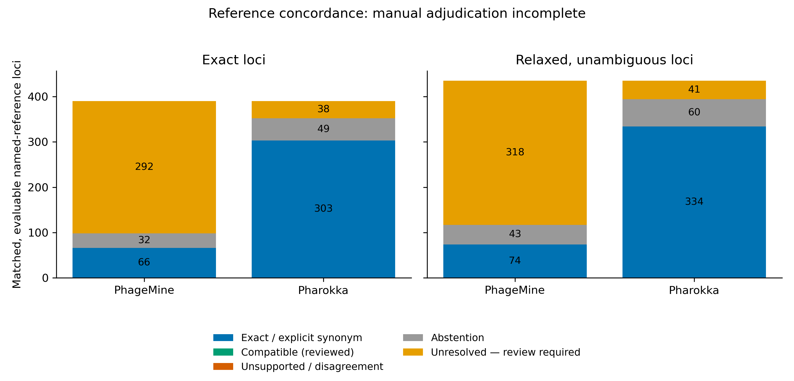

# Functional benchmark of frozen PhageMine v1.2 and Pharokka annotations

The frozen outputs were recovered and analyzed, but **functional accuracy
adjudication is incomplete**. Higher named-product yield is not evidence of
higher accuracy. No final precision, recall, F1 or significance claim is made.

The seven exact accession-version GenBank files match the SHA256 hashes of the
published structural benchmark. Original individual annotations reproduce
439 PhageMine and 398 Pharokka named products across 804 identical CDS loci.
The erroneous zero-valued PhageMine per-genome yield table has been corrected
from the original annotation tables; structural benchmark results are unchanged.

## Primary exact-locus results

There are 588 exact reference matches: 390 have informative reference products,
and 198 have non-evaluable reference products. The following denominators are
the 390 evaluable exact loci, not all predicted CDSs.

| Measure | PhageMine | Pharokka |
|---|---:|---:|
| Named assertions | 358 | 341 |
| Functional coverage | 91.79% | 87.44% |
| Descriptive Wilson 95% CI for coverage | 88.65–94.13% | 83.78–90.36% |
| Exact normalized product agreement | 62 | 303 |
| Explicit synonym agreement | 4 | 0 |
| Semantic review unresolved | 292 | 38 |
| Abstentions | 32 (8.21%) | 49 (12.56%) |
| Final strict precision / recall / F1 | NA / NA / NA | NA / NA / NA |
| Final expanded precision / unsupported specificity / disagreement rates | NA | NA |

Pharokka has more automatic reference-product agreements. Many PhageMine
products use different or more specific terminology; these require review,
not automatic acceptance or rejection. The difference in automatic agreement
cannot establish the difference in final biological accuracy. Unentered
manual categories have zero **adjudicated counts**, not a proven zero error rate.

Strict-precision identification ranges are 18.44–100% for PhageMine and
88.86–100% for Pharokka; recall ranges are 16.92–91.79% and 77.69–87.44%.
These ranges assign none/all unresolved calls to the correct category and
are **not confidence intervals or final estimates**. McNemar's paired test is
implemented but withheld until the required paired judgments are resolved.

## What are the extra named assignments?

The actual exclusive sets contain **75 PhageMine-only** and **34 Pharokka-only**
named calls. Their net difference is 41.

| Fate under exact-reference matching | PhageMine-only | Pharokka-only |
|---|---:|---:|
| Exact product agreement | 4 | 17 |
| Semantic review required | 32 | 2 |
| Non-evaluable reference product | 21 | 1 |
| No exact reference match | 18 | 14 |
| Total | 75 | 34 |

Only 36 PhageMine-only calls have an evaluable exact reference match. Four
are automatically supported and 32 await review. The final supported fraction
and its 95% CI are unavailable; its identification range is 4/36 to 36/36.
Unsupported-specificity and wrong-call totals are **unknown**, not zero.
The 21 non-evaluable references cannot validate these extra assignments;
the 18 without exact matches are excluded from primary functional scoring.
It is not defensible to describe the 75 calls as “mostly correct”.

## Secondary analysis and limitations

The separate relaxed analysis uses the published overlap thresholds, accepts
only unambiguous one-to-one residual matches, and preserves exact matches.
It yields 652 matched CDSs, of which 435 have informative reference products.
PhageMine has 392 named assertions, 74 automatic exact/synonym agreements,
318 unresolved calls and 43 abstentions. Pharokka has 375 named assertions,
334 automatic agreements, 41 unresolved calls and 60 abstentions. Accuracy
metrics remain NA in this stratum too.

Eleven compound-location reference CDSs are retained in the truth table but
excluded from functional matching; collapsing their joined intervals would
risk comparisons against unrelated overlapping CDSs. This does not alter the
588 exact matches. Relaxed functional counts are not substituted for the
published structural relaxed counts.

Classic phages can overlap annotation databases such as PHROGs, VOGDB and
Swiss-Prot. This is reference-concordant annotation performance, not a fully
independent novel-phage test. GenBank annotations are not complete experimental
truth, and missing reference functions do not establish that a named call is
wrong. Within-genome dependence also limits locus-binomial confidence intervals
and paired significance tests. No universal tool ranking follows.

A second-stage temporal or sequence-held-out panel should verify exclusion
from the actual annotation database snapshots. Candidate accessions from the
existing local temporal panel are archived separately and are not mixed into
these seven-genome results.

[Reproducible methods, input archives and review instructions](../evaluation/v1.2_functional/README.md)
include checksums, explicit synonym rules, blinded A/B review, a separate key,
per-locus evidence, source tables and PNG/SVG/PDF figures.

