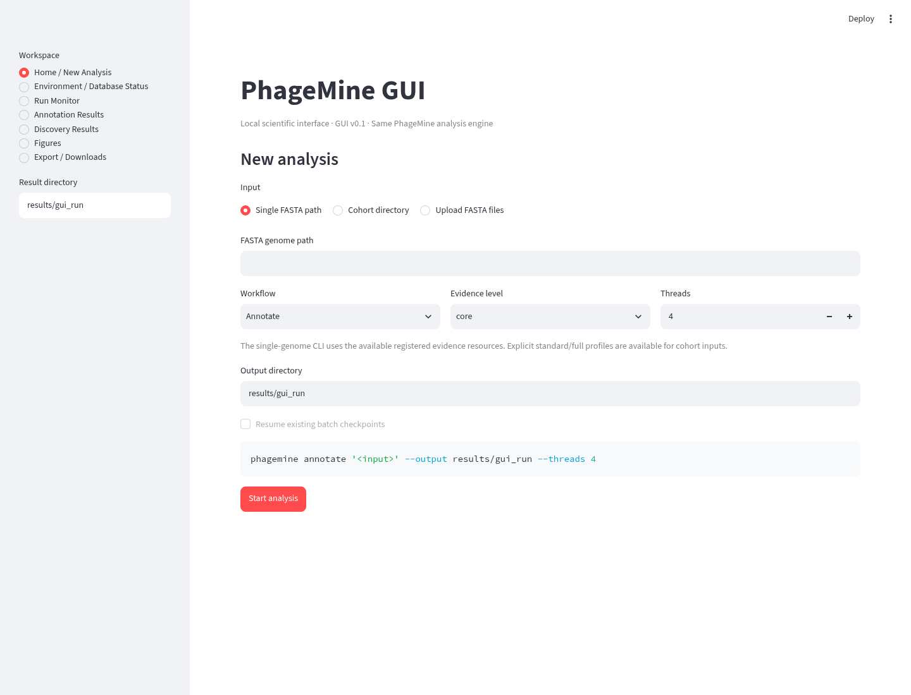
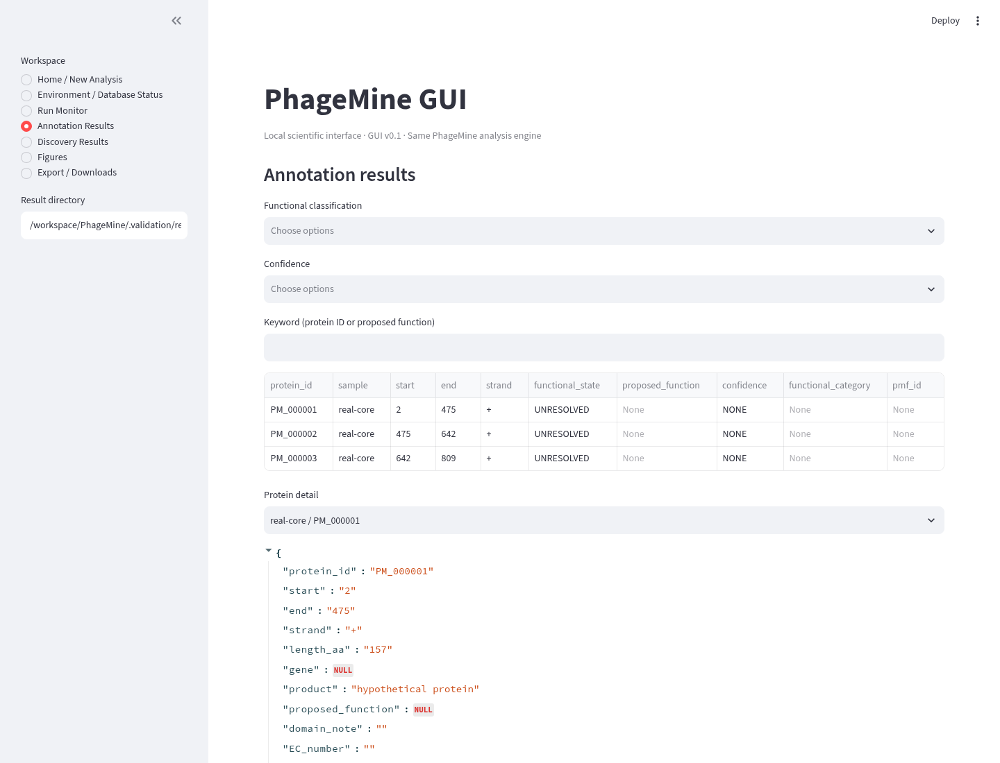

# Local graphical interface



Captured from this development branch on 2026-10-03, using the actual browser
interface. This is not a screenshot certifying the published v1.2.0 release.

Install the GUI in the same environment as PhageMine:

```bash
python -m pip install '.[gui]'
phagemine-gui
```

Open the displayed `http://127.0.0.1:8501` address on that computer. The default
launcher listens on localhost and disables Streamlit usage telemetry. Uploaded
FASTA files use temporary local storage during the run. Evidence-resource
installation still requires downloads from their providers.

## Start an analysis

Select a single FASTA file, a directory of FASTA genomes, or uploaded FASTA
files. Upload filenames must be unique. A directory must contain FASTA files;
a directory cannot be used as a single file. Home paths such as `~/genomes`
are supported.

Choose the output directory and workflow. For directory or upload inputs,
Annotate, Discover and Both use the corresponding batch workflow. Standard
and full evidence profiles apply to batch input. Single-file input delegates
to the CLI's annotate, mine or run command and uses available registered
resources; its `core` label does not mean databases are unused.

Use Environment / Database Status before a long run. Enable the operational
format check to include deep Doctor checks. The table includes external
executables, Python providers and workflow capabilities.

The interface waits for the subprocess to finish and then displays its output.
Live background execution, cancellation and concurrent jobs are not implemented.
Run Monitor reads saved checkpoints; recorded RUNNING state does not establish
that an operating-system process is still alive.

## Review results

Set the sidebar Result directory to your output path. Annotation Results shows
each sample once in Both mode and identifies a protein by sample and protein
ID. Discovery Results resolves the discovery subdirectory in Both mode and
the comparative subdirectory of a single complete run.

Run Monitor requires a finished manifest before declaring completion. Failed
samples remain failed even if their message is absent. Corrupt status files
produce warnings and prevent a completion claim. Both requires completed
annotation and discovery outputs.

Export / Downloads lists native artifacts, including the `.fsa` submission
FASTA. Select Prepare result ZIP to build an archive on demand. Symbolic links
are excluded. ZIP preparation uses memory proportional to the compressed
archive; copy the output directory directly for very large datasets.

Computational products and evidence-strength labels need scientific review.
The GUI does not establish functional accuracy or experimental confirmation.



The bundled input is synthetic and no evidence databases were installed in
this check; unresolved functions are expected.

## Development review pages

Version 1.3.0.dev0 includes Review / Curation for evidence-backed annotation edits saved to a separate result directory, and RNA Features for feature tables and provider provenance. See [annotation workflows](annotation-workflows.md) for CLI equivalents and supported features.
